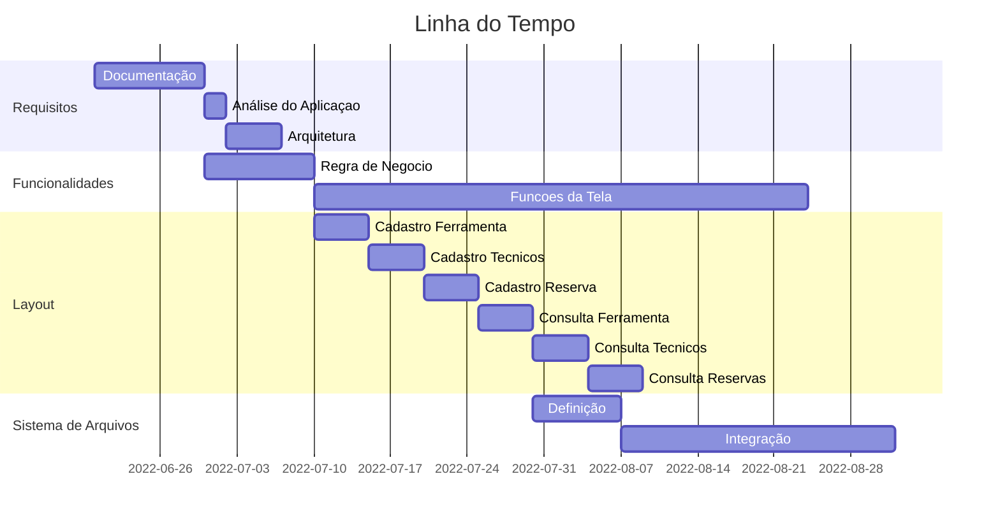

Missão Certificação - Central de Ferramentas AudioVisual - Estácio
===
## Informações do Curso
---
* ### Faculdade Estácio
* Curso: Desenvolvimento Full Stack
* Mundo: 1
* Turma: 9001
* Semestre: 1º
* Grupo: DevTeam 5
* 
## Membros da Equipe e Tutoria
---
### Equipe

* Aluno: Carmo Durante Neto
* Matrícula: 202208090583

### Tutotes

* Mestre dos Magos: Roberto Maia

## Objetivo
---

### 📌 Objetivo da Aplicação

Desenvolver uma aplicação para gerenciamento de ferramentas em um ambiente de produção de contúdo audiovisual de grande
porte.

## Contexto Geral da Aplicação e Processo
---

### 🧾 Contexto

* > Diferentes equipamentos com diversas necessidades de manutenção
* > Equipes de manutenção trabalham em turnos
* > Necessidades de diversas ferramentas específicas e com valores elevados
* > Ferramentas precisam estar em bom estado de conservação e aferidas de acordo com as normas e padrões do fabricantes
* > Ferramentas com diversas características técnicas que indicam para qual uso específico elas se aplicam
* > A correta reserva da ferramenta antes da execução do trabalho é fator crítico de sucesso

### 🧾 Descrição do Processo

* > Local onde as ferramentas ficam armazenadas chama-se “Central de Ferramentaria”
* > As ferramentas precisam ser reservadas com, no mínimo, 24 horas de antecedência
* > Solicitação de reserva são enviadas por por e-mail para o responsável pela Central
* > No momento da reserva deve-se informar: Data e Hora da Retirada e da Devolução
* > Reservas precisam ficar associadas ao técnico responsável pela sua retirada
* > Uma ferramenta só pode ser reservada se ela estiver disponível na data e hora da retirada, ou seja, não pode estar
  reservada por outro técnico no momento da retirada
* > O responsável pela central controla as devoluções de forma a garantir que as ferramentas estarão sempre disponíveis
  no momento previsto para a próxima retirada

## Entregáveis
---

### ✔ Obrigatórios

- [X] Cadastro de ferramentas
- [X] Cadastro de técnicos
- [X] Consulta as ferramentas cadastradas
- [X] Consulta dos técnicos cadastrados

### 🎉🙌 Bônus

- [X] Cadastro de reserva de ferramenta
- [X] Consulta de reservas de ferramentas
- [X] Baixar CSV das reservas, ferramentas e técnicos

## Fluxo e Funcionalidades
---

### 🔜 Descrição das Funcionalidades

* > **Tela_Inicial_Menu_Cockpit**

    * > Tela inicial/Menu irá conter os botões de naveção para as funcionalidades da aplicação.
    * > Tela inicial irá ter algumas informações úteis, como por exemplo as últimas 5 reservas feitas e 5 próximas
      reservas a vencer o prazo de devolução.

* > **Relatórios**

    * > Dentro da sessão de relatórios irá conter botões para cada tipo de consulta possível, a tela de 'Consulta' será
      a mesma para todas as consultas, mudando apenas o conteudo a ser exibido(*Lista*).
    * > O mesmo vale para a tela subsequente de 'Descrição' de cada consulta (*Descrição irá abrir como Pop-up ao clicar
      no item da lista*).
    * > Descrição deve dar detalhes, utilização e status do item.

* > **Impressão**

    * >

* > **Cadastros**

    * >

* > **Reserva/Devolução**

    * >

## Tabela de Objetos e Relacionamentos
---

#### **Tabela de Ferramentas**

| Nome Campo | Descrição | Tipo | Chave? | Informações |
| -------- | -------- | -------- | -------- | -------- |
|id_ferramenta|ID Sequencial Ferramenta|int|Sim|Código gerado de forma automática pelo sistema|
|descricao| Descricao da Ferramenta|string|Nao|Texto livre|
|fabricante|Nome do Fabricante|string|Nao|Texto livre|
|voltagem|Voltagem de uso|string|Nao|Texto livre - 110/220|
|part_number|Código no Fabricante|int|Nao| Numero Livre |
|tamanho|Tamanho|int|Nao| Texto Livre |
|un_medida|Unidade de Medida|string|Nao|cm, polegadas, metros, etc...|
|tipo|Tipo da Ferramenta|string|Nao|elétrica, mecânica, segurança|
|material|Material da Ferramenta|string|Nao|ferro, madeira, plástico, borracha|
|tempo_reserva|Tempo máximo de reserva|string|Nao|Mascara para Horas|
|status_reserva| Status Reserva |boolean|Nao|Se está reservado ou não|

---

#### **Tabela de Técnicos**
| Nome Campo | Descrição | Tipo | Chave? | Informações |
| -------- | -------- | -------- | -------- | -------- |
| id_cpf | CPF   | int     | Sim     |  Mascara de CPF   |
| nome | Nome   | string     | Nao     |  Texto Livre  |
| telefone | Telefone  | int     | Nao     |  Mascara para Celular  |
| turno | Turno   | string     | Nao     |  ListBox - manhã, tarde ou noite  |
| nome_equipe | Nome da Equipe   | string     | Nao     |  Texto Livre  |

---
#### **Tabela de Reservas**
| Nome Campo | Descrição | Tipo | Chave? | Informações |
| -------- | -------- | -------- | -------- | -------- |
| id_reserva |ID Sequencial da reserva| int| Sim     |  Código gerado de forma automática pelo sistema|
| id_ferramenta | ID Sequencial da Ferramenta     | int| Sim |Código gerado de forma automática pelo sistema|
| id_cpf | CPF do Técnico   | int     | Sim     |  Mascara de CPF|
| data_retirada_reserva |Data ferramenta retirada|date|Nao|Mascara de Datas|
| hora_retirada_reserva |Hora ferramente retirada|time|Nao|Mascara de Horas|
| data_devolução_reserva |Data ferramenta devolvida|date|Nao|Mascara de Datas|
| hora_devolução_reserva |Hora ferramente devolvida|time|Nao|Mascara de Horas|
| reserva_emer |Reserva de Emergencia|Boolean|Nao| Reserva de Emergencia Ignora a Validação de Data, porém é necessário ter estoque |

---
## Linha do Tempo do Projeto
---

###### tags: `Documentation` `Projects` `Python`
