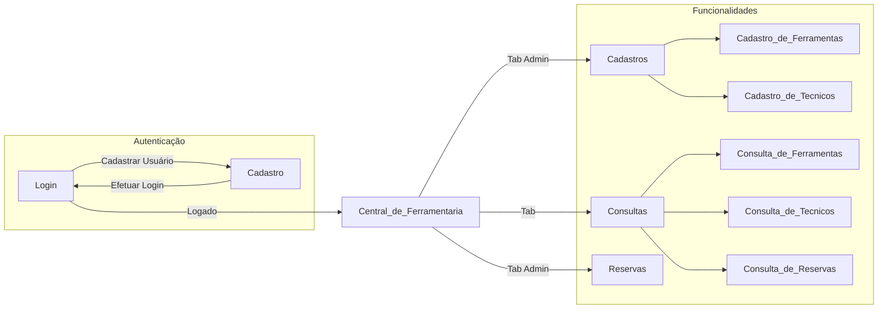
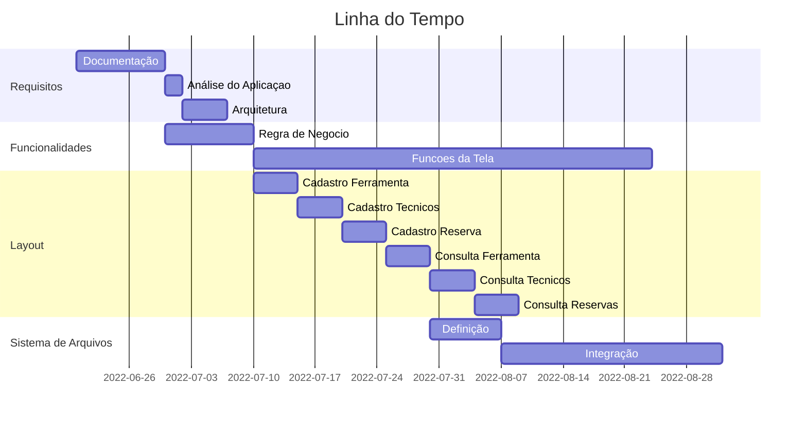

</img>
 
   
# Central de Ferramentas AudioVisual
## Como Usar e Depências
---
* Link: [Vídeo da Aplicação em Funcionamento](https://github.com/carmodurante/Aplicacao_Central_de_Ferramentaria_AudioVisual)
 
* Bibliotecas Necessárias:

      Pillow         9.2.0	
      PySimpleGUI    4.60.1
      numpy          1.23.1
      pip            22.2
      setuptools     63.2.0
      tkTimePicker   2.0.2	
      validate-docbr 1.10.0

## Informações do Curso
---
* Curso: Desenvolvimento Full Stack
* Mundo: 1
* Turma: 9001
* Semestre: 1º
* Grupo: DevTeam 5
## Membros da Equipe e Professor
---
### Equipe

* Aluno: Carmo Durante Neto
* Matrícula: 202208090583

### Professor

* Mestre dos Magos: Roberto Maia

## Objetivo
---
### 📌 Objetivo da Aplicação
      Desenvolver uma aplicação para gerenciamento de ferramentas em um ambiente de produção de conteúdo audiovisual de grande porte.

## Contexto Geral da Aplicação e Processo
---
### 🧾 Contexto
* > Diferentes equipamentos com diversas necessidades de manutenção
* > Equipes de manutenção trabalham em turnos
* > Necessidades de diversas ferramentas específicas e com valores elevados
* > Ferramentas precisam estar em bom estado de conservação e aferidas de acordo com as normas e padrões do fabricantes
* > Ferramentas com diversas características técnicas que indicam para qual uso específico elas se aplicam
* > A correta reserva da ferramenta antes da execução do trabalho é fator crítico de sucesso

### 🧾 Descrição do Processo
* > Local onde as ferramentas ficam armazenadas chama-se “Central de Ferramentaria”
* > As ferramentas precisam ser reservadas com, no mínimo, 24 horas de antecedência
* > Solicitação de reserva são enviadas por por e-mail para o responsável pela Central
* > No momento da reserva deve-se informar: Data e Hora da Retirada e da Devolução
* > Reservas precisam ficar associadas ao técnico responsável pela sua retirada
* > Uma ferramenta só pode ser reservada se ela estiver disponível na data e hora da retirada, ou seja, não pode estar reservada por outro técnico no momento da retirada
* > O responsável pela central controla as devoluções de forma a garantir que as ferramentas estarão sempre disponíveis no momento previsto para a próxima retirada

## Entregáveis
---
### ✔ Obrigatórios
- [X] Cadastro de ferramentas
- [X] Cadastro de técnicos
- [X] Consulta as ferramentas cadastradas
- [X] Consulta dos técnicos cadastrados

### 🎉🙌 Bônus
- [X] Cadastro de reserva de ferramenta
- [X] Consulta de reservas de ferramentas
- [X] Baixar CSV de Ferramenta, Tecnicos e Reservas

## Fluxo e Funcionalidades
---

### ⬅️⬆️ Fluxo das Telas

### 🔜 Descrição das Funcionalidades
* > **Central de Ferramentaria**
    * > Tela inicial/Menu irá conter os botões de naveção para as funcionalidades da aplicação.
* > **Cadastros**
    * > Poderá efetuar cadastros de tecnico e ferramenta e inserir imagem para ambos.
* > **Consultas**
    * > Poderá consultar as reservas, ferramentas e tecnicos cadastrados no sitema.
* > **Reserva/Devolução**
    * > Fazer reservas, devolução, exclusão dos registros e limpar os filtros da tela
* > **Baixar CSV**
    * > Poderá ser feito o download dos arquivos csv da base de ferramentas, tecnicos e reservas.

## Tabela de Objetos e Relacionamentos
---
#### **Tabela de Ferramentas**

| Nome Campo | Descrição | Tipo | Chave? | Informações |
| -------- | -------- | -------- | -------- | -------- |
|id_ferramenta|ID Sequencial Ferramenta|int|Sim|Código gerado de forma automática pelo sistema|
|descricao| Descricao da Ferramenta|string|Nao|Texto livre|
|fabricante|Nome do Fabricante|string|Nao|Texto livre|
|voltagem|Voltagem de uso|string|Nao|Texto livre - 110/220|
|part_number|Código no Fabricante|int|Nao| Numero Livre |
|tamanho|Tamanho|int|Nao| Texto Livre |
|un_medida|Unidade de Medida|string|Nao|cm, polegadas, metros, etc...|
|tipo|Tipo da Ferramenta|string|Nao|elétrica, mecânica, segurança|
|material|Material da Ferramenta|string|Nao|ferro, madeira, plástico, borracha|
|tempo_reserva|Tempo máximo de reserva|string|Nao|Mascara para Horas|

---

#### **Tabela de Técnicos**
| Nome Campo | Descrição | Tipo | Chave? | Informações |
| -------- | -------- | -------- | -------- | -------- |
| id_cpf | CPF   | int     | Sim     |  Mascara de CPF   |
| nome | Nome   | string     | Nao     |  Texto Livre  |
| telefone | Telefone  | int     | Nao     |  Mascara para Celular  |
| turno | Turno   | string     | Nao     |  ListBox - manhã, tarde ou noite  |
| nome_equipe | Nome da Equipe   | string     | Nao     |  Texto Livre  |

---
#### **Tabela de Reservas**
| Nome Campo | Descrição | Tipo | Chave? | Informações |
| -------- | -------- | -------- | -------- | -------- |
| id_reserva |ID Sequencial da reserva| int| Sim     |  Código gerado de forma automática pelo sistema|
| id_ferramenta | ID Sequencial da Ferramenta     | int| Sim |Código gerado de forma automática pelo sistema|
| id_cpf | CPF do Técnico   | int     | Sim     |  |
| nome| Nome do Técnico   | string    | Sim     |  |
| Descricao | Descricao da solicitação|String|Nao||
| hora_retirada_reserva |Hora ferramente retirada|time|Nao|Mascara de Horas|
| data_devolução_reserva |Data ferramenta devolvida|date|Nao|Mascara de Datas|
| hora_devolução_reserva |Hora ferramente devolvida|time|Nao|Mascara de Horas|
| emergencial |Reserva de Emergencia|Boolean|Nao| Reserva de Emergencia Ignora a Validação de Data, porém é necessário ter estoque |

---

#### Tabela de Usuários
| Nome Campo | Descrição | Tipo | Chave? | Informações |
| -------- | -------- | -------- | -------- | -------- |
| username | nome do usuário | string | Sim |  Nome do Usuário |
| email | E-mail | string | Sim |  Email do usuário |
| senha | Senha | string | Nao |  Nome do Usuário|
| admin | Administrador | boolean | Nao |  Usuário Administrador ?|

> Obs: Somente o usuário Administrador pode fazer cadastro e reserva.
    
## Linha do Tempo do Projeto
---

## Links e Referências

**Referências** 
 >[GitHub - Central de Ferramentaria](https://github.com/carmodurante/Aplicacao_Central_de_Ferramentaria_AudioVisual)

###### tags: `Documentation` `Projects` `Python`
